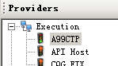

# 1.4 配置插件,让OpenQuant接入市场

##  {#configplugins}

#### **简要OpenQuant安装过程及配置插件记录**

* 安装OpenQuant最新版本;
* 安装国内市场插件;
* 配置国内市场插件:

* [ ] 交易用户名及密码信息\(UserList\)
* [ ] CTP服务器地址信息\(ServerList\)
* [ ] 交易通道组合信息\(ApiList\)
* [ ] CTP客户端认证串

 图： 配置国内市场插件 -- 天风期货CTP

配置完成后，连接插件应该能看见小小的绿色通道灯亮起。

现在，我们已经下载并安装了OpenQuant最新版本及国内市场插件。插件正确配置后可以正常连接至交易通道，可以导入当前期货合约代码，在市场开盘时段，打开OpenQuant中的QuoteMonitor界面，从Instruments窗口拖拽当前合约到QuoteMonitor界面中，可以看到该合约的当前市场报价。

