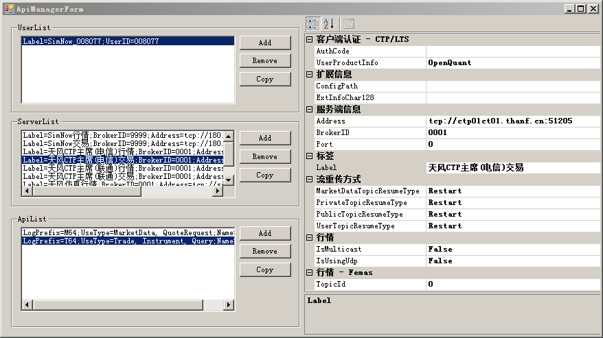
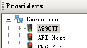

# 1. 在开始之前的准备

第一步我们要为可以长期稳定运行OpenQuant的准备一个专用环境，下载并安装好程序，配置好相应的参数，让OpenQuant可以接通中国市场。

## 1. 1 基础操作系统的选择 {#runningos}

目前的OpenQuant需要微软Windows运行环境，支持微软最新版本的OpenQuant支持Windows7，Windows8，Windows10及Windows Server 2008，Windows Server 2012等主流的Windows 64位操作系统。

安装OpenQuant软件时，OpenQuant安装程序会自动检测是否有合适的.NET Framework基础软件，如果需要安装程序会自动进行升级安装。

 建议采用Windows Server 2012以上的面向服务器的操作系统软件。

## 1.2 下载OpenQuant软件及插件 {#downloadoqandplugins}

* **OpenQuant最新版本下载地址：**

[http://www.smartquant.com](http://www.smartquant.com) 英文官方网站

[http://www.smartquant.cn](http://www.smartquant.cn) 中文服务网站

* **OpenQuant国内市场插件下载地址：**

[http://www.smartquant.cn](http://www.smartquant.cn)

[http://www.quantbox.cn/download](http://www.quantbox.cn/download)

## 1.3 安装OpenQuant软件及国内市场插件 {#installoqandplugins}

* **OpenQuant安装及国内市场插件安装过程**

详见[http://www.smartquant.cn/book/installing.html](http://www.smartquant.cn/book/installing.html)

或者下载集成了交易、行情、历史数据插件的天风版OpenQuant

## 1.4 配置插件让OpenQuant接入市场 {#configplugins}

#### **简要OpenQuant安装过程及配置插件记录**

* [ ] 安装OpenQuant最新版本;
* [ ] 安装国内市场插件;
* [ ] 配置国内市场插件:
* 交易用户名及密码信息\(UserList\)
* CTP服务器地址信息\(ServerList\)
* 交易通道组合信息\(ApiList\)

 图： 配置国内市场插件 -- 天风期货CTP

配置完成后，连接插件应该能看见小小的绿色通道灯亮起。

现在，我们已经下载并安装了OpenQuant最新版本及国内市场插件。插件正确配置后可以正常连接至交易通道，可以导入当前期货合约代码，在市场开盘时段，打开OpenQuant中的QuoteMonitor界面，从Instruments窗口拖拽当前合约到QuoteMonitor界面中，可以看到该合约的当前市场报价。

