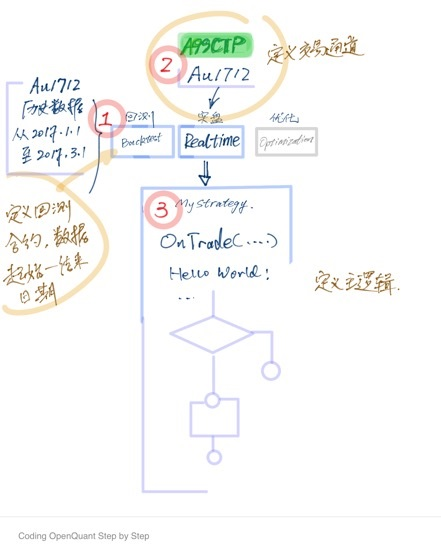

# 5. 设计一个OpenQuant的HelloWorld！

在对OpenQuant的代码结构和驱动机制有了大致的了解后，让我们来开始搞一个OpenQuant的HelloWorld系统吧...

在做任何开发工作前，都应该进行设计工作，即便是一个简单的功能。

是的，一个OpenQuant的HelloWorld需要设计一下，这个HelloWorld程序就是最基础的OpenQuant代码。虽然简单，但具备最核心的结构，未来可以扩展出我们需要的更多的解决方案。

这个HelloWorld程序要提供历史数据回测结构，要可以实盘连接到CTP交易柜台，可以订阅一个全市场最热的合约，当收到每一笔Tick行情时，在输出窗口写一句HelloWorld及所订阅合约的当前报价！

总体代码结构应该是这样的：

整个解决方案由三个工程组成：

1. 回测场景定义的**Backtest**：主要定义用于回测的合约，及其历史数据的回测时间段；
2. 实盘场景定义的**Realtime**：主要定义交易通道，实盘交易的合约。
3. 策略主体的**MyStrategy**：主要编写策略逻辑，我们的Hellow World代码就会出现在这里。

而优化（Optimization）的部分，目前先忽略。现在就来创建这个HelloWorld吧！

